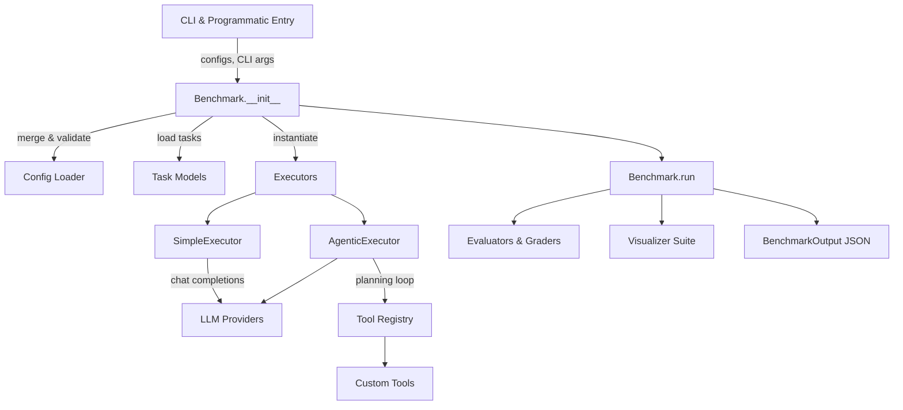

# Benchmarks

My public benchmarking library for LLM AI models. This repository is designed to provide a flexible and powerful framework for testing and evaluating various language models. It includes a variety of useful tests and tools to help you analyze model performance.



### Highlights

- Config-driven execution with environment overrides and Pydantic validation.
- Interchangeable executors for single-turn and agentic workflows.
- Evaluation pipeline supporting deterministic grading and LLM-judge scoring.
- Visualization utilities for aggregation, formatting, and plotting.

## No Installation, No API Key Required Script

There is a minimal version of the benchmark without any dependencies or API key needed using Pollinations AI. You can run it with only one line:

### Bash

```bash
curl -O https://raw.githubusercontent.com/Boden-C/benchmarks/refs/heads/main/utils/standalone.py && python standalone.py
```

### PowerShell

```powershell
Invoke-WebRequest -Uri https://raw.githubusercontent.com/Boden-C/benchmarks/refs/heads/main/utils/standalone.py -OutFile standalone.py; python standalone.py
```

## Getting Started

- Follow the end-to-end guide in [docs/running.md](docs/running.md) for installation, configuration, and CLI usage.
- Use `pip install -e .` for the core library, `pip install -e ".[viz]"` for analysis helpers, and `pip install -e ".[dev]"` for contributor tooling.
- Copy `.env.example` to `.env` and populate API keys to enable provider integrations.
- Run a benchmark with `python main.py --benchmark example_benchmark`, supplying `--models`, `--config`, or `--questions` as needed.

## Execution Modes

- **SimpleExecutor**: parallel single-turn chat completions, ideal for classification and Q&A.
- **AgenticExecutor**: multi-round planning with tool orchestration and compression strategies for complex tasks.
- Configure execution preferences in `global_config.yaml` or per-benchmark YAML files under `tests/<name>/`.

## Result Analysis

- Aggregate, format, and visualize outputs with `visualizer/aggregator.py`, `visualizer/formatter.py`, and `visualizer/graph.py`.
- Examples for Markdown, CSV, JSON, and plots are documented in [docs/running.md](docs/running.md).

## Quick Overview

- The input should be a list of chat completion requests ([Chat completion | OpenRouter | Documentation](https://openrouter.ai/docs/api-reference/chat-completion)).
- **Important**: The `ground_truth` field is required and must be included.
- The `model` field will be ignored and dynamically filled in by the models defined in `config.yaml`.
- You can declare tools, reasoning tokens, etc., in this file. Note that some models may ignore these declarations.
- Alternatively, you can use multiple `questions.json` files and leverage the static function for flexibility.

### Tip - Free Usage

- OpenRouter offers free model variants, but there are daily limits. This is recommended if you want to avoid exceeding your budget. Simply run the benchmark once per day and stay within the limit.
- [API Rate Limits | Configure Usage Limits in OpenRouter | OpenRouter | Documentation](https://openrouter.ai/docs/api-reference/limits)

## End-to-End Benchmark Workflow

### 1. Define a Benchmark Suite

- Place assets under `tests/<benchmark_name>/` (example: `tests/example_benchmark/`).
- Author `config.yaml` with metadata, model roster, executor hints, and optional grading toggles; the loader merges it with `global_config.yaml` via Pydantic validation.
- Provide `questions.jsonl` containing OpenRouter-style chat payloads; include `id`, `messages`, `ground_truth`, and any extra metadata consumed by your grader.
- Implement `<benchmark_name>.py` with a subclass of `benchmark.Benchmark`:
  - Call `super().__init_(config=..., questions=..., executor_class=...)` inside `__init__` when custom wiring is needed.
  - Override `async def grade(self, result: TaskResult, task: Task) -> Grade` to convert model output into a normalized score.
  - Optional: expose helper methods for reuse in notebooks or tests.

### 2. Execute from the CLI

- Install the library in editable mode or run within the repository.
- Invoke the entry point from PowerShell:
  - `python main.py --benchmark example_benchmark`
  - `python main.py --benchmark example_benchmark --config tests/example_benchmark/custom.yaml`
  - `python main.py --benchmark example_benchmark --questions tests/example_benchmark/custom.jsonl`
- Each flag is optional; unspecified files fall back to `tests/<benchmark_name>/config.yaml` and the config-declared questions path.
- The CLI resolves the benchmark module dynamically, instantiates the subclass, and streams structured logs while the async run completes.
- Results are emitted as a `BenchmarkOutput` instance; JSON snapshots are written to `tests/<benchmark_name>/results/` by default (configurable via `config.results.output_dir`).

### 3. Execute Programmatically

- Notebooks, scripts, or unit tests can import the benchmark class directly:

```python
from tests.example_benchmark.example_benchmark import ExampleBenchmark

# When no arguments are provided, the class loads tests/example_benchmark/config.yaml
# and tests/example_benchmark/questions.jsonl by default.
benchmark = ExampleBenchmark()

# Override inputs programmatically when needed
benchmark.config = benchmark.config.model_copy(update={"metadata": {"notes": "ad-hoc run"}})
benchmark.tasks[0].metadata["difficulty"] = "hard"

result = await benchmark.run()
```

- Both `config` and `tasks` are strongly typed Pydantic models; you may use `.model_dump()` or `.model_copy()` to persist overrides.
- For synchronous contexts, wrap `benchmark.run()` in `asyncio.run` or reuse an event loop.

### 4. Execution Flow Under the Hood

- The `Benchmark` base class loads `global_config.yaml` and the benchmark-specific YAML, merges them via `config.loader`, and validates the outcome as `BenchmarkRunConfig`.
- Tasks are parsed from JSON or JSONL into `Task` models, preserving OpenRouter semantics while discarding embedded model hints.
- The selected `Executor` is instantiated with the validated `ModelConfig` list:
  - `SimpleExecutor` issues parallel single-turn completions across providers.
  - `AgenticExecutor` mirrors the multi-round planner from the reference design, coordinating retries through `ExecutionContext`.
- Each executor returns a collection of `TaskResult` records enriched with timing, token usage, and raw provider payloads.
- The benchmark subclass receives every successful result in `grade`, producing `Grade` objects that encode score, reasoning, and grader provenance.
- `Benchmark.run()` aggregates outputs into `BenchmarkOutput`, ready for persistence, visualization, or downstream analytics.

### 5. Analyze Results

- The `visualizer/` package is separate from core benchmarking; install with `pip install -e ".[viz]"`.
- Aggregate multiple runs:

```python
from visualizer.aggregator import ResultsAggregator
from visualizer.formatter import ResultsFormatter
from visualizer.graph import GraphGenerator

aggregator = ResultsAggregator()
results = aggregator.aggregate_files([
    "results/run_2025_01_01.json",
    "results/run_2025_01_02.json"
])

stats = aggregator.calculate_summary_stats(results)

formatter = ResultsFormatter()
print(formatter.to_markdown_table(stats))
formatter.to_csv(stats, "summary.csv")

grapher = GraphGenerator()
grapher.plot_model_comparison(stats, metric="accuracy", output_path="comparison.png")
```

### 6. Next Steps

- Extend `features/tools.py` with custom tool implementations when running agentic benchmarks.
- Add new benchmarks by cloning `tests/example_benchmark/`; ensure `questions.jsonl` always supplies deterministic `ground_truth` values.
- Adjust `global_config.yaml` to tune timeouts, rate limits, and budget constraints across all benchmarks.

---

## Repository Structure

### `benchmark/`

**Enterprise-grade benchmarking library.** Designed for both CLI operation and programmatic embedding.

- **`benchmark/models.py`**: Centralizes all Pydantic models and typed aliases used across the library.
- **`benchmark/benchmark.py`**: Abstract `Benchmark` base class that users extend.
- **`benchmark/config/loader.py`**: Deterministic merging of `global_config.yaml`, benchmark-specific YAML, and overrides.
- **`benchmark/execution/`**: Contains executors for task execution, including `SimpleExecutor` and `AgenticExecutor`.
- **`benchmark/evaluation/`**: Grading and evaluation logic for benchmark results.

### `visualizer/`

**Results processing and visualization.** Optional utilities for analyzing and presenting benchmark outcomes.

- **`visualizer/aggregator.py`**: Aggregates results from multiple benchmark runs.
- **`visualizer/formatter.py`**: Formats aggregated results into human-readable formats.
- **`visualizer/graph.py`**: Generates plots and graphs from benchmark results.

### `features/`

**Extensible tool registry.** User-owned code that exposes capabilities to executors during agentic runs.

- **`features/tools.py`**: Defines the structure for tools and provides a registry for them.

### `tests/`

**Benchmark implementations and fixtures.** Each subdirectory defines an independent benchmark.

- **`tests/example_benchmark/`**: Example benchmark implementation.

### `docs/`

**Documentation hub.**

- `architecture.md`: High-level system design narrative.
- `architecture.md`: High-level system design narrative.
- `flow.md`: Runtime execution flow and mode-specific diagrams (extracted from architecture).
- `running.md`: Step-by-step operational walkthrough for defining, running, and understanding benchmarks.

### `prompts/`

**Prompt templates for agentic execution.** Contains reusable prompt templates used by `AgenticExecutor`.

- `conversationalist`: Multi-turn conversation template for interactive tasks.
- `direct`: Single-shot prompt template for direct answer tasks.

### Root Artifacts

- `.env.example`: Template showing required API keys and environment variables.
- `.gitignore`: Excludes secrets, results, cache, and build artifacts.
- `global_config.yaml`: Framework-level defaults (timeouts, budgets, rate limits, logging).
- `main.py`: CLI entry point invoked by `python main.py --benchmark <name>`.
- `pyproject.toml`: Project metadata, dependencies, and optional dependency groups.
- `example_benchmark.ipynb`: Jupyter notebook demonstrating programmatic usage and result analysis.
- `README.md`: Project overview, quickstart, contribution guidelines, and architecture summary.

## Documentation

- [Architecture Overview](docs/architecture.md)
- [Architecture Overview](docs/architecture.md)
- [Execution Flow](docs/flow.md)
- [Running Benchmarks](docs/running.md)
- [Example Benchmark Implementation](tests/example_benchmark/)
